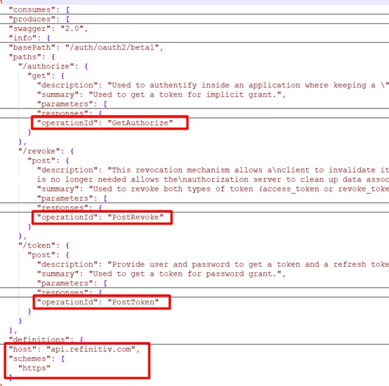
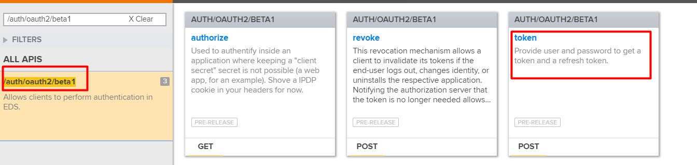
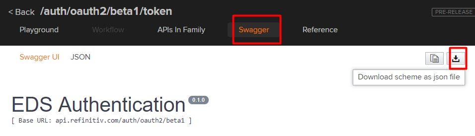
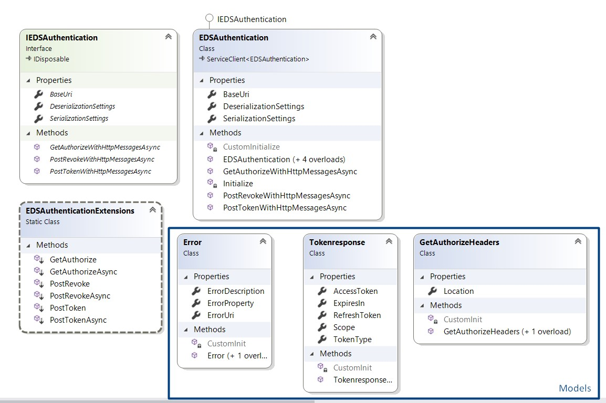
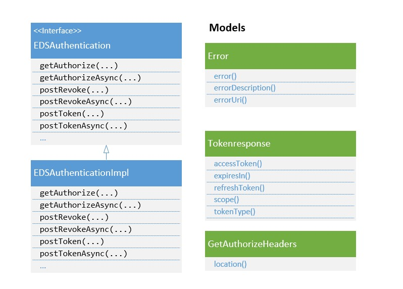
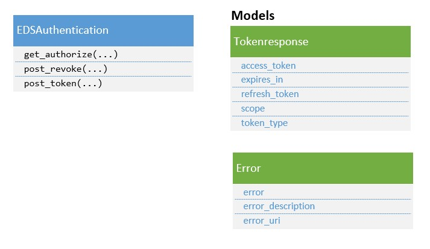

# How to use AutoRest with EDP

## EDP Overview
Elektron Data Platform (EDP) is our cloud enabled, open platform, that brings together content, analytics and proprietary, customer and third-party data distribution and management technology. It provides simple web-based API access to a broad range of content. Therefore, any programming languages which support web-based API can connect and consume data from EDP.

EDP provides online documents which list all available APIs and demonstrates how to use those APIs. Moreover, developers can also download a swagger file for each API. With this file, we can use tools such as AutoRest, or NSwagStudio to generate client libraries for accessing RESTful web services.

This article demonstrates how to use AutoRest to generate client libraries for EDP services.


## AutoRest Overview

AutoRest is an OpenAPI (Swagger) specification code generator. It is an open source tool generating client libraries for accessing RESTful web services. It can generate libraries for many programming languages including CSharp, Node.js, Python, Java, Ruby, Go,  PHP, and TypeScript. 

AutoRest is a Node.js console application. To install AutoRest, please refer to the [AutoRest website](https://github.com/Azure/autorest). 

## OperationId
AutoRest supports both swagger JSON and YAML files and the EDP website can provide swagger files in JSON format. However, if you use this JSON file with AutoRest, it will show the following errors.

```
FATAL: OperationId is required for all operations. Please add it for 'get' operation of '/authorize' path.
FATAL: AutoRest.Core.Logging.CodeGenerationException: OperationId is required for all operations. Please add it for 'get' operation of '/authorize' path.
``` 

AutoRest uses operationId to determine the method name for a given API but the swagger files from EDP may not have this field. Refer to the [OpenAPI Specification](https://github.com/OAI/OpenAPI-Specification/blob/master/versions/2.0.md), the operationId is a field under an operation object. It is a unique string used to identify the operation. The id MUST be unique among all operations described in the API. The operationId can be manually added to the swagger JSON file under the operation object, as shown below.

```
   "paths": {
        "/authorize": {
            "get": {
                "operationId": "GetAuthorize",				
                "description": "Used to authentify inside an application where keeping a \"client secret\" secret is not possible (a web app, for an example). Shove a IPDP cookie in your headers for now.",
                "summary": "Used to get a token for implicit grant.",
...
```
In the above text, the **operationId** of the get operation of the **/authorize** path is **GetAuthorize**. Instead of manually adding the operationId field, we have implemented a simple Node.js script to add the operationId field to the EDP swagger JSON file. To install and use the script, please follow these steps.

1) **Clone the project from GitHub**

```
git clone https://github.com/TR-API-Samples/Article.EDP.REST.AutoRest
```
Then, change the directory to **Article.EDP.REST.AutoRest**

2) **Build the project**

The script depends on the **command-line-args** and **command-line-usage** library. Run the following command to download the dependencies.
```
npm install
```

3) **Run the script**

The script accepts the following two parameters.

|Parameter Name|Type|Description|
|--------------|----|-----------|
|--input|String|The input JSON file downloaded from the EDP website|
|--output|String|The output JSON file after adding the operationId field|

Moreover, the script also adds the host and schemes fields.
```
node app.js --input auth_oauth2_beta1.json --output auth_oauth2_mod.json
```

The script will create a modified JSON file. It contains the added **operationId**, **host**, and **schemes** fields. The **operationId** will be generated from the **operation** and **path** field, such as **GetAuthorize**, **PostRevoke**, and **PostToken**.




## AutoRest Usage

This section explains how to use the modified JSON file from the previous step with AutoRest to generate client libraries for C#, Java, and Python. It also shows how to use the generated C#, Java, and Python classes to get an access token for password grant.

The examples use the swagger **/auth/oauth2/beta1** JSON file downloaded from the Elektron Data Platform's website. 

1) Go to [https://api.refinitiv.com/](https://api.refinitiv.com/) to find the **/auth/oauth2/beta1** service. Then, select the **token** path



2) Select the **Swagger** menu to download the swagger JSON file




Then, use the node application in the previous step to add the **operationId** to the file.

```
node app.js --input auth_oauth2_beta1.json --output auth_oauth2_mod.json
```


The AutoRest's options used in this section are:

|Option|Description|
|------|-----------|
|--input-file=FILENAME|Adds the given file to the list of input files for generation process|
|--output-folder=DIRECTORY|The location for generated files. If not specified, uses ./Generated as the default|
|--namespace=NAMESPACE|sets the namespace to use for the generated code|
|--package-name=PACKAGENAME|Name of the package (Ruby, Python)|
|--csharp|Runs the C# code generator|
|--java|Runs the java code generator|
|--python|Runs the python code generator|

### C#

Run the following command with the modified JSON file to generate C# client library.

```
autorest --input-file=auth_oauth2_mod.json --csharp --output-folder=CSharp --namespace=edp.auth 
```

The above uses the **auth_oauth2_mod.json** file to generate the C# class library in the **CSharp** folder. The namespace of the classes is **edp.auth**.

The class diagram for the generated classes is shown below.



The main class is **EDSAuthentication** which provides several methods to access EDP services. Developers can call methods with the **WithHttpMessagesAsync** suffix to get the low level **HttpOperationResponse** object containing the HTTP response body and response headers. Otherwise, the extension methods, such as **GetAuthorize**, **PostRevoke**, and **PostToken**, can be used to get the object level response. The model classes are also generated for the response (**Tokenresponse**) and error (**Error**).

The generated C# classes depend on **Microsoft.Rest.ClientRuntime** and **Newtonsoft.Json** so those libraries must be installed in the project. 

The following code shows how to use **EDSAuthentication** to perform EDP authentication.

```CSharp
using edp.auth;
using edp.auth.Models;

static void Main(string[] args){

	EDSAuthentication eds = new EDSAuthentication();
	try{
		var response = eds.PostToken("password"
			, "<username>"
			, "<password>"
			, null
			, "trapi"
			, null
			, "<clientid>"
			, "true");

		if (response is Tokenresponse){
			Tokenresponse tokenResp = (Tokenresponse)response;
			Console.WriteLine(tokenResp.AccessToken);
		}else if(response is edp.auth.Models.Error){
			edp.auth.Models.Error tokenError = (edp.auth.Models.Error)response;
			Console.WriteLine(tokenError.ErrorProperty+":"+ tokenError.ErrorDescription);
		}
	}catch (HttpOperationException ex){
		Console.WriteLine("Exception:"+ex.Response.ToString());
	}
}        

```
The above code calls the extension method (**PostToken**) with a username and password to get a token. Then, the returned object will be casted to the **Tokenresponse** or **Error** object according to its type.

### Java

Run the following command with the modified JSON file to generate Java client library.

```
autorest --input-file=auth_oauth2_mod.json --java --output-folder=Java --namespace=edp.auth 
```

The above uses the **auth_oauth2_mod.json** file to generate the Java class library in the **Java** folder. The namespace of the classes is **edp.auth**.

The class diagram for the generated classes is shown below.



The interface, implementation, and model classes are generated. The main class is **EDSAuthenticationImpl** which provides several synchronous and asynchronous methods to access the service. The model classes are also generated for the response (**Tokenresponse**) and error (**Error**).

The client library depends on the **com.microsoft.rest.client-runtime** library. Developers need to install this library and its dependencies. 

```
<dependency>
    <groupId>com.microsoft.rest</groupId>
    <artifactId>client-runtime</artifactId>
    <version>1.6.5</version>
</dependency>
```

However, there is a problem in the generated classes. The **"consumes"** field in the **auth_oauth2_beta1.json** file is **"application/x-www-form-urlencoded"**.  Refer to the [OpenAPI Specification](https://github.com/OAI/OpenAPI-Specification/blob/master/versions/2.0.md), the **consumes** field is a list of MIME types the APIs can consume. 

```
{
    "consumes": [
        "application/x-www-form-urlencoded"
    ],
    "produces": [
        "application/json"
    ],
    "swagger": "2.0",
    "info": {
        "description": "Allows clients to perform authentication in EDS.",
        "title": "EDS Authentication",
        "version": "0.1.0"
    },
```

When a value of the **"consumes"** field in the swagger file is **"application/x-www-form-urlencoded"**, the content type of the request message must be **application/x-www-form-urlencoded**. However, the generated Java class sets the content type of the request message to **multipart/form-data** instead. This causes a bad request with the following error returned to the application.

```
{  
   "error":{  
      "id":"786a57ea-c5a6-4177-a7f8-af8c9cbc710f",
      "code":"400",
      "message":"Validation error",
      "status":"Bad Request",
      "errors":[  
         {  
            "key":"grant_type",
            "reason":"Invalid Content-Type 'multipart/form-data', allowed: [application/x-www-form-urlencoded]"
         }
      ]
   }
```

To solve this issue, the generated **EDSAuthenticationImpl.java** must be modified by changing Java annotations of the **postRevoke** and **postToken** methods from **@Multipart** and **@Part** to **@FormUrlEncoded** and **@Field** respectively, as shown below.

```Java
...
import retrofit2.http.FormUrlEncoded;
...

    interface EDSAuthenticationService {
        ...

        
        @FormUrlEncoded
        @POST("revoke")
        Observable<Response<ResponseBody>> postRevoke(@Field("token") String token, @Field("token_type_hint") String tokenTypeHint, @Field("client_id") String clientId);
        
       
        @FormUrlEncoded        
        @POST("token")
        Observable<Response<ResponseBody>> postToken(@Field("grant_type") String grantType, @Field("username") String username, @Field("password") String password, @Field("deviceId") String deviceId, @Field("scope") String scope, @Field("refresh_token") String refreshToken, @Field("client_id") String clientId, @Field("takeExclusiveSignOnControl") String takeExclusiveSignOnControl, @Field("multiFactorAuthenticationCode") String multiFactorAuthenticationCode, @Field("newPassword") String newPassword);
        

    }
```

After modifying the code, we can use the **EDSAuthenticationImpl** class to perform EDP authentication, as shown below.

```Java
    public static void main( String[] args )
    {
       
        EDSAuthentication auth = new EDSAuthenticationImpl();
        Object resp = auth.postToken( "password"
        		, "<username>"
        		, "<password>"
        		, null
        		, "trapi"
        		, null
        		, "<clientid>"
        		, "false"
        		, null
        		, null);
        
        if(resp instanceof Tokenresponse) {
        	System.out.println("Access Token: "+((Tokenresponse) resp).accessToken());
        }else if(resp instanceof Error) {
        	System.out.println("Error: "+((Error)resp).errorDescription());
        }             
    }
```
The above code calls the **postToken** method with username and password to get a token. Then, the returned object is casted to the **Tokenresponse** or **Error** object according to its type.

### Python

Run the following command with the modified JSON file to generate Python client library.

```
autorest --input-file=auth_oauth2_mod.json --python --output-folder=Python --namespace=edp.auth --package-name=edp.auth
```

The above uses the **auth_oauth2_mod.json** file to generate the Python class library in the **Python** folder. The namespace and package name of the classes is **edp.auth**.

The class diagram for the generated classes is shown below.



The main class is **EDSAuthentication** which provides several methods to access EDP services. The model classes are also generated for the response (**Tokenresponse**) and error (**Error**).

The client library depends on the **AutoRest Python Client Runtime**. Developers can use the following command to install this library.

```
pip install msrest
```

The following code shows how to use **EDSAuthentication** with Python to perform EDP authentication.

```Python
import edp.auth as auth

edpAuth = auth.EDSAuthentication()

resp = edpAuth.post_token("password"
                          , "<usrname>"
                          , "<password?"
                          , scope="trapi"
                          ,client_id="<clientid>"
                          ,take_exclusive_sign_on_control="true")

if hasattr(resp, 'access_token'):
    print(resp.access_token)
elif hasattr(resp, 'error_description'):
    print(resp.error_description)
```
The above code calls the **post_token **method with username and password to get a token. Then, it uses the **hasattr()** method to verify the presence of the **access_token** or **error_description** of the returned object.

## Troubleshoot

1) Get this error **"AutoRest.Core.Logging.CodeGenerationException: OperationId is required for all operations."** when running AutoRest
  
> AutoRest uses the **operationId** fields as method names for the generated class. Please make sure that the **operationId** field is under the operation field. Otherwise, the node.js script mentioned in the **OperationId** section can be used to add the **operationId** field to the swagger JSON file.


2) Get this error **"Invalid URI: The format of the URI could not be determined."** or **"The method or operation is not implemented."** when running the application

> The swagger file may not have **host** or **schemes** field. AutoRest uses the values in these fields to connect to the server. Please make sure that the host is set to **api.refinitiv.com** and the schemes is **https**. 

```
  "host": "api.refinitiv.com",
  "schemes": [
    "https"
  ]
```
>Otherwise, the node.js script mentioned in the **OperationId** section can be used to add these fields to the swagger JSON file.

3) Get this error **"Invalid Content-Type 'multipart/form-data', allowed: [application/x-www-form-urlencoded]"** when running Java code

> The generated Java code doesn't support the request message with the **'application/x-www-form-urlencoded'** content type. The generated code must be modified to support this content type. For more information, please refer the **AutoRest Usage/Java** section.

## Summary
This article introduces how to use AutoRest to generate client libraries for Elektron Data Platform services. Using AutoRest can save developers time; Developers don't need to implement its own classes to consume REST services from Elektron Data Platform. 

The steps are summarized here. First, download the swagger JSON file from the Eletron Data Platform's website. Then, run the node.js script with the downloaded file to create a new JSON file with the **operationId** fields. AutoRest uses the **operationId** fields as method names for generated classes. After that, run the AutoRest command with the modified JSON file to generate the client library. Next, install dependencies for the client library. Then, construct a class, and call an appropriate method. Finally, a returned object may need to be casted according to its type.


## References
1. [AutoRest](https://github.com/Azure/autorest)   
2. [AutoRest for C# Client](https://github.com/Azure/autorest/blob/master/docs/client/proj-setup.md)
3. [AutoRest for Java Client](https://github.com/Azure/autorest-clientruntime-for-java)
4. [AutoRest for Python Client](https://github.com/Azure/msrest-for-python)
5. [OpenAPI Specification](https://github.com/OAI/OpenAPI-Specification/blob/master/versions/2.0.md)
6. [NSwagStudio](https://github.com/RSuter/NSwag/wiki/NSwagStudio)
